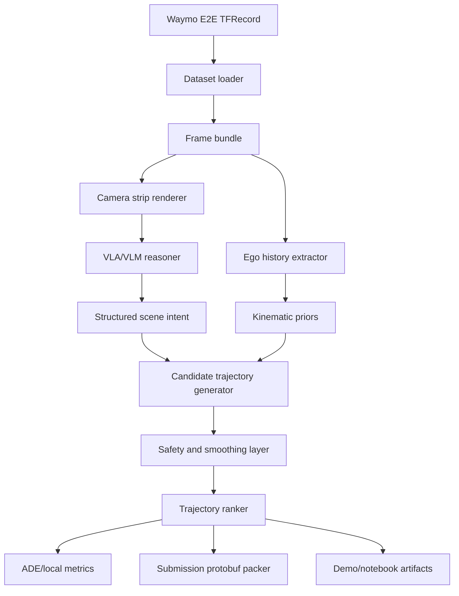

# Architecture

0xDriver is planned as an offline-first minimal-shot autonomy pipeline for
Waymo Open Dataset End-to-End Driving scenes.

## Purpose

Build and demonstrate a latency-aware VLA-inspired driving architecture without
training a new model from scratch. The system should convert visual scene
understanding into structured driving intent, then use deterministic trajectory
generation, smoothing, ranking, and evaluation to produce 5-second ego
trajectory predictions.

## System Map

## Canonical Surfaces

- `AGENTS.md`: operational map loaded every loop.
- `PROJECT_RULES.md`: stack, runtime commands, validation, and artifact policy.
- `ARCHITECTURE.md`: top-level system map.
- `README.md`: product story and setup.
- `docs/prd.md`: first-release product requirements.
- `docs/specs/README.md`: index of deeper specs.
- `tickets/README.md`: ticket lifecycle once implementation starts.

## Main Future Runtime Modules

- Dataset module: parse Waymo E2E TFRecords and expose frame bundles.
- Visualization module: render camera strips and trajectory overlays.
- Reasoning module: call VLA/VLM or mock backend and validate structured intent.
- Planner module: generate candidate trajectories from intent and ego state.
- Safety/smoothing module: enforce plausible speed, acceleration, curvature, and
  continuity constraints.
- Evaluation module: compute ADE and assemble latency/evidence reports.
- Submission module: write Waymo E2E protobuf shards and package archives.

## Read Order

1. `AGENTS.md`
2. `PROJECT_RULES.md`
3. `docs/bootstrap-brief.md`
4. `docs/prd.md`
5. `docs/specs/README.md`
6. `docs/specs/directory-structure-plan.md`
7. active ticket once tickets exist

## Current Limits

- No runtime code exists yet.
- No dataset files are expected in git.
- No cloud GPU endpoint has been selected.
- No claim is made that the first release is a real-time closed-loop driver.
- The first slice targets offline Waymo E2E predictions and demo evidence.
