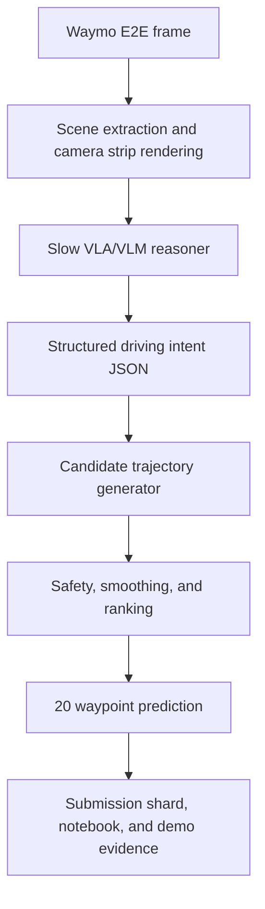

# 0xDriver

0xDriver is a docs-first research engineering project for the SoTA Commission I
minimal-shot autonomy challenge. The thesis is simple: use large VLA/VLM
reasoning sparingly for long-tail scene understanding, then compile that
reasoning into fast, constrained trajectory proposals that can be evaluated on
Waymo Open Dataset End-to-End Driving scenes.

This repo is not starting by training a new model. The current release provides
a runnable offline autonomy pipeline, dependency-free fixtures, optional Waymo
E2E ingestion seams, and submission packaging surfaces that can be hardened into
a challenge submission.

## Project Goal

Build a latency-aware minimal-shot driving architecture that can:

- load and visualize Waymo E2E driving frames
- use VLA-inspired scene reasoning to classify long-tail hazards and intent
- generate and smooth 5-second ego trajectories at 4 Hz
- measure local proxy quality with ADE and latency accounting
- produce submission-ready artifacts, a short write-up, and a 1-5 minute demo

## Core Architecture Direction



The important design choice is decoupling semantic reasoning from low-level
control. The VLA/VLM should explain the scene and suggest intent; deterministic
planning code should turn that intent into valid trajectories.

## Shared Inspiration Resources

- SoTA Commission I: Minimal-Shot Autonomy, shared from SoTA Letters. Challenge
  asks for a simulation environment or Waymo E2E-style autonomous vehicle demo,
  with a GitHub repo, analysis notebook, 1-5 minute video or slide deck, and
  short write-up. Deadline referenced in the prompt: May 10, 2026.
- [FlashDrive](https://z-lab.ai/projects/flashdrive/): early-preview
  algorithm-system co-design work for real-time driving VLAs. Useful ideas:
  streaming KV/cache reuse, compact structured reasoning, speculative decoding,
  adaptive flow/action generation, quantization, CUDA graphs, and kernel fusion.
- Realtime-VLA V2: deployment-stack inspiration for making VLA robotics fast,
  smooth, and accurate. Useful ideas: server/client split, time-axis action
  planning, realtime chunking/action prefill, local smoothing/MPC, aligned logs,
  asynchronous video recording, and mock hardware paths.
- [Waymo Open Dataset](https://waymo.com/open/) and
  [Waymo Open Dataset GitHub](https://github.com/waymo-research/waymo-open-dataset):
  source for E2E driving data loading, visualization, future-trajectory labels,
  submission protobuf generation, and ADE/rater-feedback tutorial patterns.

## Repository Shape

- `docs/prd.md`: product requirements for the first release
- `docs/bootstrap-brief.md`: bootstrap decisions, quality gates, and local-vs-cloud assumptions
- `docs/specs/directory-structure-plan.md`: implementation structure plan
- `ARCHITECTURE.md`: top-level system map
- `PROJECT_RULES.md`: stack, commands, quality gates, and conventions
- `qa/`: evidence and reproducibility cookbook
- `tickets/`: ticket planning and implementation surface
- `src/driverx/`: Python package for loading, reasoning, planning, evaluation,
  visualization, and packaging

## Current Status

TASK-001 through TASK-006 establish the first credible measuring stick: the repo
can run without Waymo data or a VLA model, ingest optional real Waymo TFRecords
through Docker, package official submission protobufs when the Waymo
dependencies are available, stream a small real Waymo validation batch into
`batch_summary.json` plus `batch_report.md`, compare deterministic baselines,
and route the main planner through a hybrid semantic-intent plus motion-prior
candidate set.

The first real 10-frame hybrid Waymo batch selected
`constant_acceleration_smooth` for all frames and matched the strongest TASK-005
deployable baseline with mean ADE `3.73323`, improving over the old mock-intent
planner mean ADE `6.204769`. This is the local action layer future VLA/GPU
backends should steer and beat.

## Quickstart

```bash
# Inspect the configured fixture scene and write an SVG artifact
PYTHONPATH=src python3 -m driverx inspect-scene --config configs/mock.yaml

# Inspect a Waymo E2E-shaped local fixture through the Waymo loader seam
PYTHONPATH=src python3 -m driverx inspect-scene --config configs/waymo_fixture.yaml

# Run the full mock pipeline
PYTHONPATH=src python3 -m driverx run-scene --config configs/mock.yaml --run-id demo

# Run a tiny fixture validation batch
PYTHONPATH=src python3 -m driverx run-batch --config configs/mock.yaml --run-id demo-batch

# Compare deterministic trajectory strategies on one fixture scene
PYTHONPATH=src python3 -m driverx run-experiment --config configs/mock.yaml --run-id demo-experiment

# Run a Waymo-shaped fixture through the Waymo batch path
PYTHONPATH=src python3 -m driverx run-batch --config configs/waymo_fixture.yaml --run-id waymo-fixture-batch --frame-count 1

# Evaluate an existing run directory
PYTHONPATH=src python3 -m driverx evaluate --run-dir artifacts/runs/demo

# Create a dry-run submission package
PYTHONPATH=src python3 -m driverx package-submission --run-dir artifacts/runs/<run-id>

# Try official Waymo protobuf serialization when optional deps are installed
PYTHONPATH=src python3 -m driverx package-submission --run-dir artifacts/runs/<run-id> --official

# Exercise fail-closed behavior for malformed reasoner output
PYTHONPATH=src python3 -m driverx run-scene --config configs/invalid_reasoner.yaml --run-id invalid-demo

# Run local checks
bash scripts/pre_push_check.sh
```

Generated run artifacts are written under `artifacts/runs/` and remain ignored
by git.

## Optional Real Waymo Data

The fixture path is the default. The official Waymo package currently resolves
cleanly in a Linux x86_64 environment, not native macOS ARM. On the MacBook,
build the Docker compatibility image and mount the repo into it:

```bash
scripts/build_waymo_docker.sh
scripts/run_waymo_docker.sh
```

`scripts/run_waymo_docker.sh` defaults to the downloaded validation shard at
`data/val_202504211843.tfrecord-00000-of-00093`. To point at another downloaded
TFRecord file, directory, or glob, set `WAYMO_E2E_TFRECORD` before running the
script. Host paths under the repo are translated to `/workspace/...` inside the
container.

```bash
WAYMO_E2E_TFRECORD=data/val_202504211843.tfrecord-00000-of-00093 \
  scripts/run_waymo_docker.sh \
  python -m driverx run-scene --config configs/waymo_local.sample.yaml --run-id waymo-smoke
```

Run the first real-data batch baseline before changing planner or VLA-serving
logic:

```bash
WAYMO_E2E_TFRECORD=data/val_202504211843.tfrecord-00000-of-00093 \
  scripts/run_waymo_docker.sh \
  python -m driverx run-batch \
    --config configs/waymo_local.sample.yaml \
    --run-id waymo-batch-10 \
    --frame-start 0 \
    --frame-count 10
```

The batch root will include `batch_summary.json` and `batch_report.md`; each
frame also keeps the normal `scene_prediction.svg`, `metrics.json`, and
`timings.json` artifacts.

Run the current hybrid planner over the first 10 real validation frames:

```bash
WAYMO_E2E_TFRECORD=data/val_202504211843.tfrecord-00000-of-00093 \
  scripts/run_waymo_docker.sh \
  python -m driverx run-batch \
    --config configs/waymo_local.sample.yaml \
    --run-id waymo-hybrid-batch-10 \
    --frame-start 0 \
    --frame-count 10
```

Compare the current hybrid planner against non-VLA rule baselines on the same
real slice. When `dataset.kind=waymo`, `run-experiment` defaults to 10 frames
if `--frame-count` is omitted:

```bash
WAYMO_E2E_TFRECORD=data/val_202504211843.tfrecord-00000-of-00093 \
  scripts/run_waymo_docker.sh \
  python -m driverx run-experiment \
    --config configs/waymo_local.sample.yaml \
    --run-id waymo-experiment-10 \
    --frame-start 0 \
    --frame-count 10
```

The experiment root includes `experiment_summary.json` and
`experiment_report.md`. `oracle_best_rule` is labeled analysis-only because it
uses ground-truth ADE to choose among rule baselines.

On a Linux x86_64 machine, such as a rented GPU server, the same image can be
built natively. If you do not use Docker there, install the Waymo dependency
stack with the requirements file so pip uses the required JAX wheel index:

```bash
python -m pip install -r requirements/waymo-linux.txt
python -m pip install -e .
```

If the optional packages are missing, the Waymo loader and `--official`
submission mode fail with install guidance instead of importing TensorFlow at
normal startup.

Before using `--official`, fill the submission metadata in your config:
`account_name` must be the email registered at `waymo.com/open`, and
`num_model_parameters` must include a suffix such as `200K`, `7B`, or `0K`.

## Cloud GPU Workflow

Keep the Mac as the planning, fixtures, docs, and deterministic pipeline
environment. Use a cloud NVIDIA GPU only for the heavy VLM/VLA inference server:

1. Develop and test loaders, planners, packagers, and mock reasoners locally.
2. Build the same Docker runtime on the GPU host after cloning the repo.
3. Run a long-lived inference service on the GPU host, not a cold-start
   serverless function, when testing latency-sensitive VLA behavior.
4. Send rendered scene panels and metadata to the GPU service, cache structured
   intent responses, and keep trajectory generation/evaluation reproducible in
   this repo.
