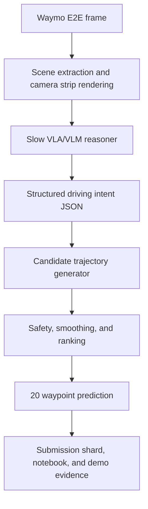

# 0xDriver

0xDriver is a docs-first research engineering project for the SoTA Commission I
minimal-shot autonomy challenge. The thesis is simple: use large VLA/VLM
reasoning sparingly for long-tail scene understanding, then compile that
reasoning into fast, constrained trajectory proposals that can be evaluated on
Waymo Open Dataset End-to-End Driving scenes.

This repo is not starting by training a new model. The current release provides
a runnable offline autonomy pipeline, dependency-free fixtures, optional Waymo
E2E ingestion seams, and submission packaging surfaces that can be hardened into
a challenge submission.

## Project Goal

Build a latency-aware minimal-shot driving architecture that can:

- load and visualize Waymo E2E driving frames
- use VLA-inspired scene reasoning to classify long-tail hazards and intent
- generate and smooth 5-second ego trajectories at 4 Hz
- measure local proxy quality with ADE and latency accounting
- produce submission-ready artifacts, a short write-up, and a 1-5 minute demo

## Core Architecture Direction



The important design choice is decoupling semantic reasoning from low-level
control. The VLA/VLM should explain the scene and suggest intent; deterministic
planning code should turn that intent into valid trajectories.

## Shared Inspiration Resources

- SoTA Commission I: Minimal-Shot Autonomy, shared from SoTA Letters. Challenge
  asks for a simulation environment or Waymo E2E-style autonomous vehicle demo,
  with a GitHub repo, analysis notebook, 1-5 minute video or slide deck, and
  short write-up. Deadline referenced in the prompt: May 10, 2026.
- [FlashDrive](https://z-lab.ai/projects/flashdrive/): early-preview
  algorithm-system co-design work for real-time driving VLAs. Useful ideas:
  streaming KV/cache reuse, compact structured reasoning, speculative decoding,
  adaptive flow/action generation, quantization, CUDA graphs, and kernel fusion.
- Realtime-VLA V2: deployment-stack inspiration for making VLA robotics fast,
  smooth, and accurate. Useful ideas: server/client split, time-axis action
  planning, realtime chunking/action prefill, local smoothing/MPC, aligned logs,
  asynchronous video recording, and mock hardware paths.
- [Waymo Open Dataset](https://waymo.com/open/) and
  [Waymo Open Dataset GitHub](https://github.com/waymo-research/waymo-open-dataset):
  source for E2E driving data loading, visualization, future-trajectory labels,
  submission protobuf generation, and ADE/rater-feedback tutorial patterns.

## Repository Shape

- `docs/prd.md`: product requirements for the first release
- `docs/bootstrap-brief.md`: bootstrap decisions, quality gates, and local-vs-cloud assumptions
- `docs/specs/directory-structure-plan.md`: implementation structure plan
- `ARCHITECTURE.md`: top-level system map
- `PROJECT_RULES.md`: stack, commands, quality gates, and conventions
- `qa/`: evidence and reproducibility cookbook
- `tickets/`: ticket planning and implementation surface
- `src/driverx/`: Python package for loading, reasoning, planning, evaluation,
  visualization, and packaging

## Current Status

TASK-001 is complete: the repo can run without Waymo data or a VLA model by
using synthetic scenes and mock structured intent. TASK-002 is adding optional
real Waymo TFRecord loading and official protobuf packaging while preserving
that dependency-free path.

## Quickstart

```bash
# Inspect the configured fixture scene and write an SVG artifact
PYTHONPATH=src python3 -m driverx inspect-scene --config configs/mock.yaml

# Inspect a Waymo E2E-shaped local fixture through the Waymo loader seam
PYTHONPATH=src python3 -m driverx inspect-scene --config configs/waymo_fixture.yaml

# Run the full mock pipeline
PYTHONPATH=src python3 -m driverx run-scene --config configs/mock.yaml --run-id demo

# Run a tiny fixture validation batch
PYTHONPATH=src python3 -m driverx run-batch --config configs/mock.yaml --run-id demo-batch

# Evaluate an existing run directory
PYTHONPATH=src python3 -m driverx evaluate --run-dir artifacts/runs/demo

# Create a dry-run submission package
PYTHONPATH=src python3 -m driverx package-submission --run-dir artifacts/runs/<run-id>

# Try official Waymo protobuf serialization when optional deps are installed
PYTHONPATH=src python3 -m driverx package-submission --run-dir artifacts/runs/<run-id> --official

# Exercise fail-closed behavior for malformed reasoner output
PYTHONPATH=src python3 -m driverx run-scene --config configs/invalid_reasoner.yaml --run-id invalid-demo

# Run local checks
bash scripts/pre_push_check.sh
```

Generated run artifacts are written under `artifacts/runs/` and remain ignored
by git.

## Optional Real Waymo Data

The fixture path is the default. To validate on real Waymo E2E data, install the
optional packages and point `configs/waymo_local.sample.yaml` at one downloaded
TFRecord file, directory, or glob:

```bash
python -m pip install ".[waymo]"
export WAYMO_E2E_TFRECORD="/path/to/validation.tfrecord*"
PYTHONPATH=src python3 -m driverx inspect-scene --config configs/waymo_local.sample.yaml
PYTHONPATH=src python3 -m driverx run-scene --config configs/waymo_local.sample.yaml --run-id waymo-smoke
```

If the optional packages are missing, the Waymo loader and `--official`
submission mode fail with install guidance instead of importing TensorFlow at
normal startup.

Before using `--official`, fill the submission metadata in your config:
`account_name` must be the email registered at `waymo.com/open`, and
`num_model_parameters` must include a suffix such as `200K`, `7B`, or `0K`.
