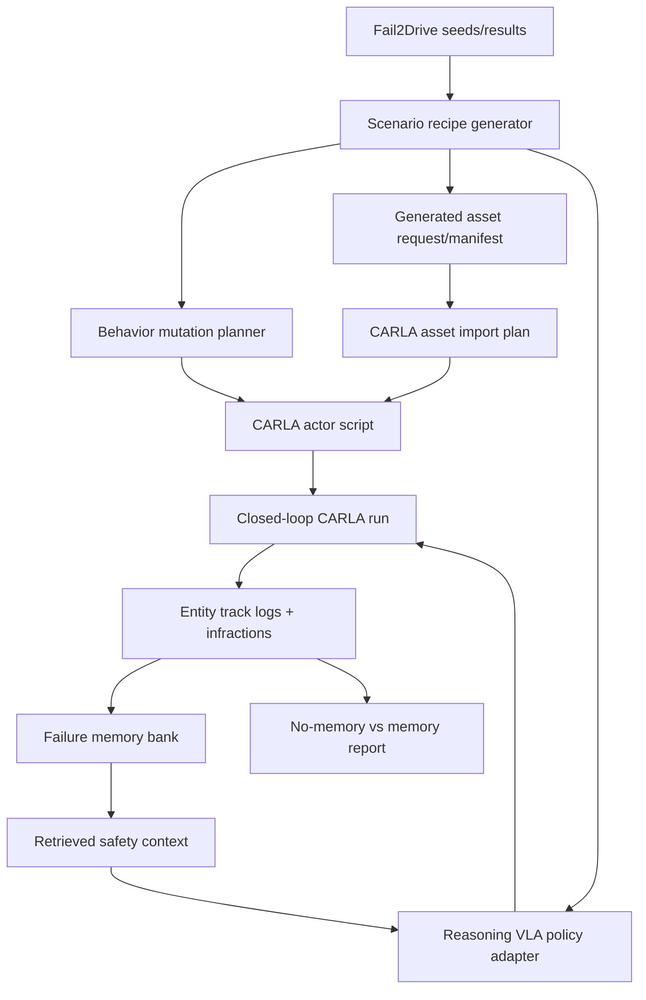

# Minimal-Shot VLA Roadmap

Last updated: 2026-05-04 18:58 +0800

## Thesis

0xDriver should demonstrate a minimal-shot autonomy loop, not just a single
CARLA script:

1. Start from Fail2Drive OOD route seeds and policy failures.
2. Generate new weird-but-plausible closed-loop scenarios.
3. Add object/asset novelty and regional driving behavior novelty.
4. Run a frozen reasoning VLA/VLM policy with and without retrieved safety
   memory.
5. Measure whether memory-guided reasoning improves route safety without
   fine-tuning.

The submission story is: **a scenario forge plus retrieval memory harness for
reasoning VLA autonomy generalization**.

## End-to-End Flow

## Ticket Roadmap

### TASK-008: Live CARLA Probe And Docker Bridge

Prove CARLA API access against the running Wine/Kegworks CARLA app through a
Linux amd64 Docker client. Write map, actor, weather, settings, and version
evidence. This turns `smoke-carla` from TCP proof into API proof.

### TASK-009: Ego Spawn, Camera Capture, And Entity Tracks

Spawn one ego vehicle, attach an RGB camera, capture one frame, log actor
transforms over time, and destroy actors cleanly. This proves 0xDriver can
observe and clean up CARLA entities.

### TASK-010: Regional Driving Behavior Library

Implement deterministic behavior scripts and offline kinematic tests for
regional/OOD traffic patterns:

- no-signal cut-in
- sudden brake
- motorcycle filtering
- wrong-way shoulder creep
- informal right-of-way push
- stunt/superman motorcycle surrogate as a low-profile fast two-wheeler proxy

The first pass can simulate traces offline and compile them into CARLA actor
script plans before live execution.

### TASK-011: Scenario-To-CARLA Script Compiler

Convert `ScenarioRecipe` + behavior plan into an executable CARLA script plan:
spawn points, actor blueprints, per-tick controls, sensors, output paths, and
cleanup. This is a local compiler before exporting full Fail2Drive XML.

### TASK-012: Generated Asset Pipeline

Add an asset provider interface and manifest format for generated artifacts.
Start with local placeholder assets and a dry-run provider. Add Meshy or another
3D generation API only when an API key is available. Validate every generated
asset by dimensions, collision proxy, semantic tags, source prompt, and license
metadata before it can be used in a scenario.

### TASK-013: Policy Adapter Interface

Add a policy abstraction that can wrap:

- mock/rule policy for tests
- local hybrid planner as a fallback
- VLM/API policy mode for low-friction reasoning tests
- SimLingo/CarLLaVA as the first CARLA-native VLA target
- Alpamayo as a later trajectory-VLA target

Adapters must emit structured action intent, control/trajectory output,
latency, and reason summaries without requiring model fine-tuning.

### TASK-014: Retrieval-Augmented VLA Comparison Harness

Run the same generated scenario under two modes:

- policy without memory
- policy with retrieved safety memory

The report compares success, route completion, infractions, entity tracks,
latency, and behavior deltas. Until a real VLA exists, a deterministic mock
policy should prove the harness and make clear that the score is a harness
validation, not a model claim.

### TASK-015: SimLingo Backend Readiness And Run Planner

Inspect the external SimLingo/CarLLaVA checkout, document its CARLA/Python/CUDA
requirements, and emit a reproducible Bench2Drive evaluation command plan.

### TASK-017: Remote GPU SimLingo One-Route Proof

Run stock SimLingo against one Bench2Drive route on a Linux NVIDIA GPU host or
capture a precise runtime blocker. The RTX PRO 6000 Blackwell pass reached route
execution but failed at the first model tick because upstream torch 2.2.0 lacks
`sm_120` kernels; the next stock run should use H100/H200-class `sm_90`.

### TASK-018: Generated Bench2Drive Route Pack Export

Export generated OOD recipes as stock-compatible Bench2Drive route XML plus
DriverX sidecar overlays. The route XML is safe to pass to SimLingo now; the
overlay carries the generated objects, regional behavior id, memory query, and
expected failure mode until a companion CARLA actor injector exists.

### TASK-019: SimLingo Result Ingestion

Parse SimLingo/Bench2Drive result JSON, route logs, and CUDA compatibility
snapshots into stable JSON/Markdown reports for comparison and final demo
evidence.

### TASK-021: Overlay Injection Plan

Compile DriverX route-pack sidecar overlays into dry-run companion CARLA script
plans. This produces the actor, sensor, tick, memory-query, and cleanup
schedule that a future live injector will run beside stock SimLingo, while
remaining honest that current artifacts do not yet alter SimLingo behavior.

## Mesh / Asset API Readiness

A Meshy API key is useful for TASK-012, but it is not needed for TASK-008
through TASK-011. The local code can first implement:

- asset request JSON
- provider interface
- dry-run provider
- manifest validation
- prompt and metadata logging
- placeholder CARLA asset mapping

When a real API key is provided, the provider can generate `.glb` or `.obj`
assets and record the output in the same manifest shape.

## Autonomy Inputs

Useful now:

- CARLA app open and loaded.
- Docker Desktop running.
- Permission to pull Docker images and install disposable packages.

Useful soon:

- Meshy or equivalent 3D asset API key.
- Preferred policy target: SimLingo/CarLLaVA, API VLM, or Alpamayo.
- Hugging Face access for gated model checkpoints.
- Cloud GPU budget and provider preference for real VLA/Fails2Drive runs.
- Final demo format preference: video first, slide deck as backup.

## Current Autonomy Boundary

The agent can implement and test autonomously:

- Docker CARLA client bridge.
- CARLA API probe.
- ego spawn and camera capture scripts.
- offline behavior trace simulation and assertions.
- entity track logging and reports.
- asset-provider dry-run and manifest validation.
- policy adapter interfaces and mock policies.
- RAG comparison harness with fixture/mocked policy runs.

The agent needs operator help for:

- recovering CARLA if the Wine app crashes or hangs.
- real asset API key use.
- real VLA/model checkpoints.
- cloud GPU spending and credentials.
- subjective demo selection once multiple scenarios work.
